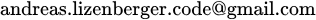

## Personal Details

Andreas Lizenberger M.Sc. | Software Engineer Germany - NRW - Siegen  <a href="https://github.com/alpha-zero-one">GitHub</a> <a href="https://de.linkedin.com/in/andreas-lizenberger-a13253404">LinkedIn</a>

## About

Computer Scientist and Software Engineer, combining a background in Artificial Intelligence and Data Science with a foundation in Software System Development.

Areas of Interest:
- Artificial Intelligence, Neural Networks, Large Language Models
- Recommender Systems
- Development of Software and Applications

Academic Background in Computer Science:
- Mathematics and Data Science
- Visual Computing
- Theoretical Computer Science

Technical Foundation in:
- Web Technologies (HTML, CSS, JavaScript)
- Python, Java, SQL
- Data Structures, Algorithms, Concurrent Programming

## Education

**Master of Science in Computer Science** 07.04.2026 - University of Siegen ➙ Grade: Overall 1.3, Thesis 1.3

**Bachelor of Science in Computer Science with Minor in Mathematics** 24.08.2021 - University of Siegen ➙ Grade: Overall 2.0, Thesis 1.3

**Abitur (German A-levels)** 20.06.2013 - Dietrich-Bonhoeffer-Gymnasium Neunkirchen (Siegerland) ➙ Grade: Overall 1.9

## Teaching Experience

Conducted weekly tutorial sessions to support students, explained technical concepts, answered course-related questions, and graded assignments.

**Teaching Assistant** 2015-2022 - University of Siegen

| Period | Subject |
|:---|:---|
| Winter 2020, 2021, 2022 | Operating Systems ➙ Java, Concurrent Programming |
| Summer 2016, 2021, 2022 | Object-Oriented and Functional Programming ➙ Java and Python Programming Languages |
| Winter 2018 | Mathematics Preparatory Course ➙ Introduction to Analysis and Linear Algebra |
| Winter 2015 | Database Systems ➙ SQL, Relational Database |

## Academic Projects

| Date | Title | Source |
|:---|:---|:---|
| 08.04.2026 | Evaluation by Simulation: Fine-Tuning LLMs to Implement Code-Feedback  | [↘ pdf](/academic_projects/evaluation_by_simulation.pdf)   |
| 28.05.2024 | Rethinking Recommender Systems: Cluster-based Algorithm Selection | [↗ pdf](https://arxiv.org/pdf/2405.18011) [↗ link](https://arxiv.org/abs/2405.18011) |
| 29.02.2024 | Data Imbalance in Machine Learning: Approaches for Dealing with Highly Imbalanced Datasets | [↘ pdf](/academic_projects/data_imbalance_in_machine_learning.pdf) |
| 07.01.2024 | Sensitivity Conjecture | [↘ pdf](/academic_projects/sensitivity_conjecture.pdf) |
| 15.09.2023 | Scribble-based Image Segmentation with Convexity Constraints | [↘ pdf](/academic_projects/scribble_image_segmentation.pdf) |
| 26.11.2021 | Navigational Queries for Forest Straight-Line Programs | [↘ pdf](/academic_projects/navigational_queries_for_fslp.pdf) |
